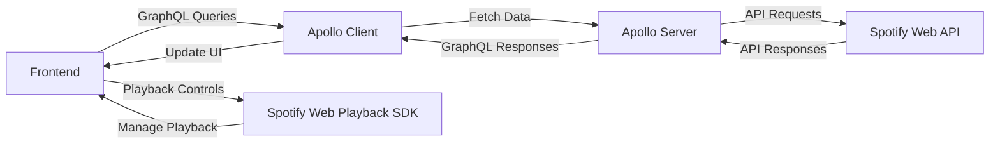

# 🎧 Spotify

> [!IMPORTANT]  
> Both **Spotify Playback** and **Spotify Web API** require users to authenticate with a valid Spotify **Premium** subscription.

 

## 🎹 Features

♪ **Real-Time Music Playback**: Play songs using the Spotify Playback SDK.  
♪ **Playback Controls**: Full playback functionality including play, pause, next, previous, shuffle, and repeat.  
♪ **Personalized Access**: View and play your saved playlists, albums, and liked songs.  
♪ **Playback Devices**: Switch between different playback devices (desktop, mobile, smart speakers).  
♪ **Lyrics Sync**: Follow along with synced lyrics for a karaoke-like experience.  
♪ **Custom Playlists**: Create and manage your own playlists within the app.

 

## 🎸 Technologies Used

♪ **Next.js**: Frontend framework for building user interface.  
♪ **Apollo Client**: GraphQL client for fetching data from Apollo Server.  
♪ **Zustand**: Client state management.  
♪ **Node.js(Express)**: Backend server handling Spotify Web API requests and managing authentication.  
♪ **Apollo Server**: GraphQL server for securely delivering Spotify data to the frontend.  
♪ [**Spotify Web API**](https://developer.spotify.com/documentation/web-api): Used exclusively by the backend server for fetching Spotify data like playlists, albums, and playback status.  
♪ [**Spotify Playback SDK**](https://developer.spotify.com/documentation/web-playback-sdk): Enables real-time music playback on the frontend.

 

## 🥁 Architecture Overview

This project follows a client-server architecture that integrates the Spotify Web Playback SDK for real-time music playback and the Spotify Web API for data fetching.

### 1. Backend (Express + Apollo Server)

- Handles authentication with `Spotify API` (OAuth flow). 👉 [blog post](https://hwanheejung.tistory.com/65)
- Fetches Spotify data (e.g., playlists, albums, playback state) via the `Spotify Web API`.
- Acts as a `GraphQL server` (using Apollo Server) to securely expose Spotify data to the frontend.
- Manages sensitive credentials (e.g., Spotify client ID and secret) and ensures they are never exposed to the client.

### 2. Frontend (Next.js + Apollo Client) 👉 [repo](https://github.com/hwanheejung/Spotify-LT-Client)

- Connects to the backend's `Apollo Server` to retrieve and display Spotify data using GraphQL.
- Manages playback controls (play, pause, skip) and state updates via the `Spotify Web Playback SDK`.
- Directly interacts with `Spotify's playback server` for real-time track streaming and control.
- Does not directly communicate with the `Spotify Web API`, ensuring API credentials are securely managed by the backend.

### 3. Communication Flow

 

## 📸 Screenshots

 

## 🛠️ Troubleshooting

- **Playback Not Starting**: Ensure you have a Spotify **Premium** account and the app is connected to an active device.

- **Authentication Errors**: Verify your environment variables and Spotify Developer Dashboard settings.

- **API Rate Limits**: Avoid exceeding Spotify Web API’s rate limits. Use caching to optimize requests.
